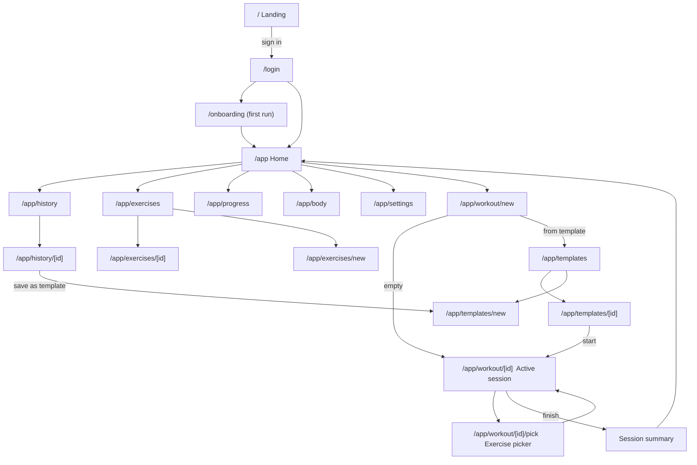
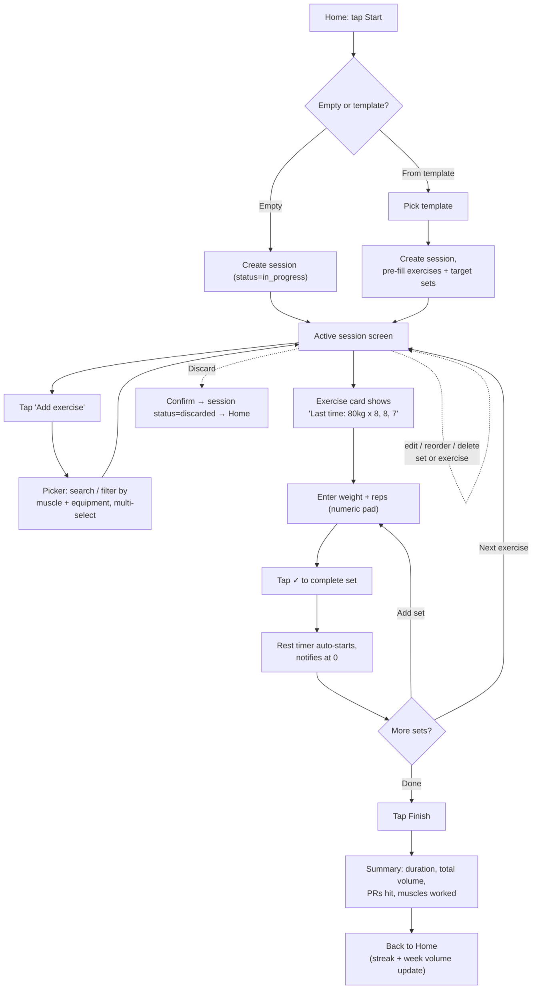
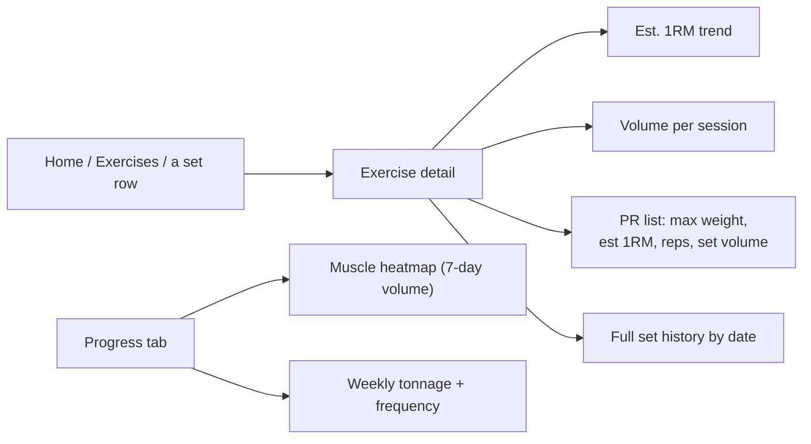
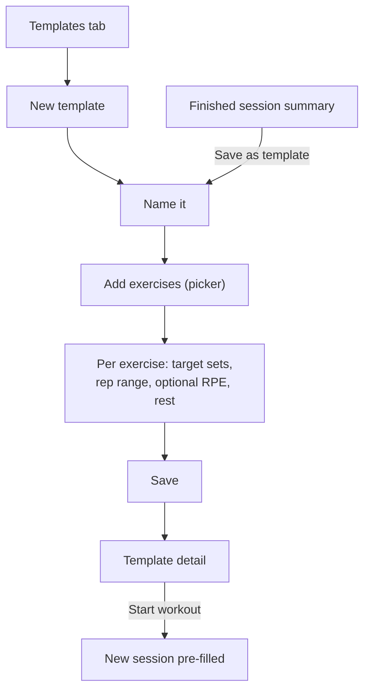
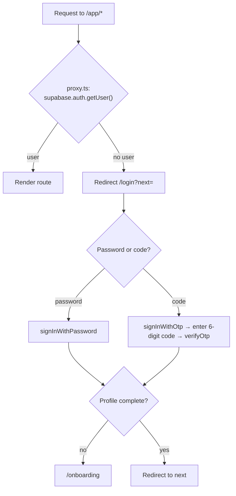

# RepLog — UX Flows & Information Architecture

Status: draft for review
Companion to [`SPEC.md`](SPEC.md).

## Design targets

- **Primary device:** phone, one-handed, used mid-workout with sweaty hands and
  poor gym wifi. Big tap targets, numeric keypads, minimal navigation depth.
- **Form factor:** mobile-first, one responsive layout. A single column, full-bleed
  on phones, capped at `max-width: 480px` centred on wider screens. Desktop is **not
  blocked** — it just shows the phone UI centred. Design/QA at 360–430px only; no
  tablet or desktop layouts in v1 (see `DESIGN_SYSTEM.md §5`).
- **Primary task:** log a set in ~2 taps. Everything else is secondary.
- **Fidelity for first design pass:** mid-fi (real type, spacing, one accent colour).

## Route / screen inventory

| Route | Screen | Auth | Notes |
|---|---|---|---|
| `/` | — | public | No landing page. Redirects: authed → `/app`, else → `/login`. |
| `/login` | Sign in / sign up | public | Email + password (primary) or 6-digit email code. Segmented toggle. `?next=` return path. Code entry + "confirm email" are states of this route. |
| `/login/reset` | Forgot password | public | email → 6-digit code → new password. Shares the code-entry screen with `/login`. |
| `/auth/callback` | Email-confirm / recovery handler | public | `verifyOtp` for links that still arrive by email; redirects to `next`. |
| `/terms` · `/privacy` | Legal | public | Static content pages, linked from Create account. |
| `/onboarding` | First-run setup | authed | Display name, kg/lb, default rest. Shown once. |
| `/app` | Home / dashboard | authed | Start-workout CTA, resume banner, week volume, streak, mini heatmap, recent sessions. |
| `/app/workout/new` | Start workout | authed | Choose **Empty** or **From template**. |
| `/app/workout/[id]` | Active session (the core loop) | authed | Exercise cards, set rows, rest timer, finish/discard. |
| `/app/workout/[id]/pick` | Exercise picker | authed | Sheet/modal. Search + filter by muscle/equipment. Multi-select add. |
| `/app/history` | Session history | authed | Cursor-paginated list, newest first. |
| `/app/history/[id]` | Session detail | authed | Read-only past session; edit reopens it. |
| `/app/exercises` | Exercise library | authed | Search/filter; global + custom. |
| `/app/exercises/new` | New custom exercise | authed | Name, muscles, equipment, movement. |
| `/app/exercises/[id]` | Exercise detail | authed | Est. 1RM trend, volume trend, PR list, full set history. |
| `/app/templates` | Templates | authed | List + create. |
| `/app/templates/new` | Build template | authed | Name, ordered exercises, targets. |
| `/app/templates/[id]` | Template detail / edit | authed | Start session from here. |
| `/app/progress` | Progress overview | authed | Full muscle heatmap, tonnage, frequency, per-lift 1RM. |
| `/app/body` | Bodyweight | authed | One entry/day, trend chart. Reached from Profile. |
| `/app/profile` | Profile | authed | Opened from the Home header avatar. Identity (editable name + avatar colour), stubbed stats strip, preferences (unit, default rest), change password, → Body, sign out, legal links. Every field that's a form (name, avatar colour, default rest, change password) opens the same shadcn Dialog (centred, not a bottom sheet — avoids the mobile keyboard covering the field being edited); units is the one instant, dialog-free toggle. Merges what would otherwise be a separate Settings screen — v1's settings list is short enough not to need its own route. |

## Navigation model

Two floating, elevated pills stacked above the content — not docked flush
to the screen edge — inset ~14px from the sides on every `/app/*` screen.

```
        ╭─────────────────────────────────╮
        │  Start Workout / Resume — 12:34  │  ← contextual pill (state-driven)
        ╰─────────────────────────────────╯
        ╭─────────────────────────────────╮
        │ Home   History   Exercises  Prog │  ← tab pill (always the same 4)
        ╰─────────────────────────────────╯
```

- **Floating, not docked.** Every other surface in the system (cards,
  popovers, OTP boxes) is an inset rounded shape on the obsidian ground —
  the nav bar follows the same rule instead of being the one element flush
  to the edge. It also reads correctly at any viewport: the app is a
  centred ≤480px column everywhere (`DESIGN_SYSTEM.md §5`), so a bar flush
  to the *column's* edges implies a phone chassis that isn't there on web.
- **Compact, not stretched.** Both pills size to their own content (padding,
  not `width: 100%`) and centre themselves in the available width — a short
  label like "Start Workout" shouldn't be floating inside a bar stretched to
  the full column width, and the tab tray only needs to be as wide as its
  4 items plus the active tab's label.
- The contextual pill is the single primary action, always present, and
  changes state instead of coexisting with a separate FAB:
  - **Idle** (no `in_progress` session): "Start Workout" → `/app/workout/new`.
  - **Active** (an `in_progress` session exists): "Resume — mm:ss elapsed",
    volt-tinted, live-updating timer → `/app/workout/[id]`. Survives
    navigating between tabs.
- No floating action button — this avoids two competing "raised" elements
  fighting for attention on a small screen.
- Tabs are icon-only at rest — inactive tabs are plain icon circles on a
  subtle lighter fill. The active tab becomes a solid volt pill with icon
  **+ label** at a **fixed width** (sized to the longest label, "Exercises")
  — so the tray never resizes as you switch tabs, only the active pill's
  position and label change. The label confirms where you are rather than
  helping you choose (you already tapped it). Real build: animate the
  position change on tab switch (shared-layout transition) so it slides
  instead of jump-cutting.
- Content scrolling under the pills gets a bottom fade + enough scroll
  padding that nothing is hidden behind the floating stack.
- Templates reached from Home and from the workout-start sheet. Profile
  (identity, preferences, account — see `/app/profile`) from the Home header
  avatar, not in the tab bar. Body reached from within Profile, not directly
  from the avatar.

### Auto-hide on scroll

The nav shell hides on scroll-down and reveals on scroll-up — not on an
inactivity timer, and with no dedicated reveal control. The reveal gesture
(scroll up) is self-explanatory and needs no extra icon; a timer risks
hiding the shell while someone is simply reading a chart, not scrolling.

- **Exempt while a session is `in_progress`.** The contextual pill's job in
  that state is "Resume" — the single fastest way back into an active
  workout. Hiding it fights the app's #1 goal (log a set in ~2 taps), so
  the whole shell stays visible and ignores scroll direction whenever a
  session is active. Hide/show only applies in the **idle** state, where
  "Start Workout" is lower-urgency.
- **Thresholds** (asymmetric — harder to hide than to reveal, so it doesn't
  flicker on small scroll jitter): always visible while `scrollTop ≤ 24px`
  (space-6). Below that, hide once cumulative downward scroll exceeds
  `16px` (space-4) since the last direction change; reveal on any upward
  scroll exceeding `4px`.
- **Motion**: `translateY` + opacity, `base` 180ms, `standard` easing
  (`DESIGN_SYSTEM.md §4`). `prefers-reduced-motion`: opacity only, no
  transform.
- Only meaningfully relevant on screens with real scroll content: History,
  Exercises, Progress. Home is mostly above-the-fold and rarely triggers it.

## Sitemap



## Core flow — log a workout



## Flow — review progress



## Flow — templates



## Auth / gating



## Key screen contents (mid-fi checklist)

**Home `/app`**
- Header: avatar (→ settings/body), app name, streak flame + count
- No in-page Start/Resume button — that's the nav's contextual bar
  (see Navigation model above), present on every screen
- "This week": total volume, sessions count, sparkline
- Mini muscle heatmap (tap → Progress)
- Recent sessions (3) → History

**Active session `/app/workout/[id]`**
- Sticky header: session name/time, elapsed timer, **Finish** button, overflow (rename, discard)
- Rest-timer pill (appears after completing a set; tap to adjust/skip)
- Per exercise: name, "last time" line, set table (set #, prev, kg, reps, RPE, ✓), **+ Add set**
- Drag handle to reorder; swipe row to delete
- **+ Add exercise** (opens picker sheet)

**Exercise picker `/app/workout/[id]/pick`**
- Search field (autofocus)
- Filter chips: muscle group, equipment
- Results list with muscle tag; tap to toggle; **Add N** button

**Exercise detail `/app/exercises/[id]`**
- Title, muscles, equipment
- PR row (4 stat tiles)
- Chart: est. 1RM trend (toggle volume)
- Set history grouped by date

**Session summary**
- Duration, total volume, set count
- PRs hit (celebratory)
- Muscles worked (mini heatmap)
- **Save as template** / **Done**

## Open questions

1. ~~Landing page~~ — resolved: none, `/login` is the entry.
2. Bottom-tab labels — icons only, or icons + text? *(icons + text drawn)*
3. Rest timer: full-screen takeover, or just the pill? *(pill drawn)*
4. Supersets are out of v1 — okay to omit the reorder-into-group affordance entirely for now?
5. ~~Auth screens Terms / Privacy links~~ — resolved: keep them. Needs real `/terms` + `/privacy` pages.
